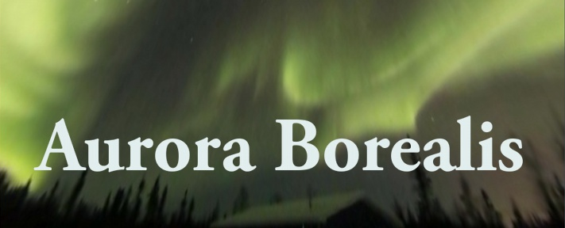

Use the Oculus Rift to see the aurora borealis of March 17, 2013 as recorded from opposite sides of the Earth.  In addition to the northern lights, see how many constellations you can make out.  Download this demo here:

**[Aurora Borealis Demo 1.2](http://mit.garagegames.com/AuroraBorealis-1-2.zip)**

To find out more about the *Aurora Borealis* demo please head over to the announcement blog:

<http://www.garagegames.com/community/blogs/view/22255>

#### Related Pages
[Main Demo Page](Demos)
