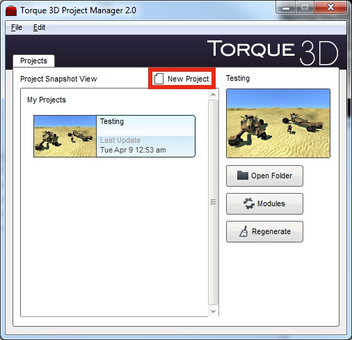
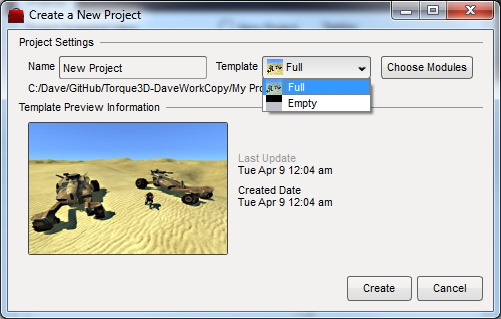

The Torque 3D *Project Manager* is an optional utility that helps you create new projects based on Torque 3D Templates as well as manage existing projects.

## Where to Find the Project Manager
The *Project Manager* may be downloaded from here: ???  Just follow the instructions in its *ReadMe* file on where to install it.  (All versions of the Project Manager may be found here: [Project Manager Archive](Project-Manager-Archive))

If you wish to instead compile from source, head over to the *Project Manager* repository: [Torque3D-ProjectManager](https://github.com/GarageGames/Torque3D-ProjectManager)  It uses [Qt 4.8.x](http://qt-project.org/downloads) for its interface so you will need to obtain that first.

## Create a New Project From a Template
Torque 3D has a number of *Templates* that may be used as a starting point for your own project.  The *Project Manager* makes it easy to create new projects from these *Templates*.  Begin by launching *Project Manager.exe*.

This is the main window of the *Project Manager* that displays a list of any existing projects.  To create a new project, click on the *New Project* button.

This will open the *Create a New Project* window.

From here you may give your project a new name and choose which *Template* will be copied to your project.  Torque 3D is also made up of a number of optional modules that may be compiled into the code base.  These modules may determine which physics library will be used, or that a particular input device will be supported.  To choose which modules will be included with your project you click on the *Choose Modules* button.

This opens the *Project Modules* window.

From this window you select which modules you want to include and click on the *OK* button.  Please see the **Using the Project Modules Windows** section below for more information on using this window.

With your new project now all set up you click on the *Create* button.  A new window will open informing you of the project creation progress which includes copying the files from the chosen *Template*, configuring all of the project's files, and generating the project's solution for compiling.  Your project is now ready to be turned into your game!

## Modifying an Existing Project

## Using the Project Modules Window

## Related Pages
[Project Manager Archive](Project-Manager-Archive)  
