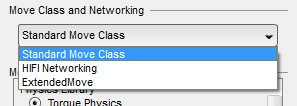

The Torque 3D *Project Manager* is an optional utility that helps you create new projects based on Torque 3D Templates as well as manage existing projects.

## Where to Find the Project Manager
The *Project Manager* may be downloaded from here: [ProjectManager-2-0.zip]( http://mit.garagegames.com/ProjectManager-2-0.zip)  Just follow the instructions in its *ReadMe* file on where to install it.  (All versions of the Project Manager may be found here: [Project Manager Archive](Project-Manager-Archive))

If you wish to instead compile from source, head over to the *Project Manager* repository: [Torque3D-ProjectManager](https://github.com/GarageGames/Torque3D-ProjectManager)  It uses [Qt 4.8.x](http://qt-project.org/downloads) for its interface so you will need to obtain that first.

## Create a New Project From a Template
Torque 3D has a number of *Templates* that may be used as a starting point for your own project.  The *Project Manager* makes it easy to create new projects from these *Templates*.  Begin by launching *Project Manager.exe*.

This is the main window of the *Project Manager* that displays a list of any existing projects.  To create a new project, click on the *New Project* button.

This will open the *Create a New Project* window.

From here you may give your project a new name and choose which *Template* will be copied to your project.  Torque 3D is also made up of a number of optional modules that may be compiled into the code base.  These modules may determine which physics library will be used, or that a particular input device will be supported.  To choose which modules will be included with your project you click on the *Choose Modules* button.

This opens the *Project Modules* window.

From this window you select which modules you want to include and click on the *OK* button.  Please see the **Using the Project Modules Windows** section below for more information on using this window.

With your new project now all set up you click on the *Create* button.  A new window will open informing you of the project creation progress which includes copying the files from the chosen *Template*, configuring all of the project's files, and generating the project's solution for compiling.  Your project is now ready to be turned into your game!

## Modifying an Existing Project's Modules
You may change which optional modules are compiled into your project at any time.  This is done from the main *Project Manager* window by first selecting your project and then clicking on the *Modules* button.

**NOTE: Prior to changing any modules, be sure to close your project's solution in Visual Studio**

This will open the *Project Modules* window.  From here you may make changes to which modules or *Move* class will be used by your project.

After you have made your changes you click on the *Regenerate* button.  This will automatically regenerate your project's solution files, and your project may be recompiled.  For more information on using the *Project Modules* window please see the next section.

## Using the Project Modules Window
The *Project Modules* window is divided into two sections.

### Move Class and Networking
The top section allows you to choose the type of *Move* class and networking that will be used.

The *Standard Move Class* is what the majority of games will use.  This allows sending of a player's movements (such as from mouse, keyboard or joystick) to the server for the object they are controlling.  This also provides the standard tick processing for the server's network traffic.

The *HIFI Networking* choice operates the same as the *Standard Move Class* except that the server's network processing is no longer bunched together per tick.  Instead the networked movement process happens more often and is intended for high speed objects that may collide together.  This mode was intended to be used by racing games, for example.  Unfortunately, this mode has not received a lot of attention and may require some additional work to use.

The *ExtendedMove* choice enables an extended version of the standard *Move* class.  This allows for the sending of absolute position and rotation values to the game's server.  This is very useful when dealing with input devices that support his type of data, such as the *Leap Motion*, *Razer Hydra* and *Oculus Rift*.  Please see the [ExtendedMove Page](ExtendedMove-Class) for more information, as well as the pages for the specific input device you are interested in.

### Modules
The middle section is where you may choose the modules that will be compiled into your project.

Modules may either be part of a group where one of them must be selected (such as the *Physics Library* group) or standalone with a checkbox to choose the module.

Some modules require additional information from the user such as a path to a 3rd party SDK.  An example of this is the *Razer Hydra* controller in the image above.  If that module is chosen then you need to provide a path to the SDK (which is the *SixenseSDK_062612* directory as of this writing).  You may either manually enter the path into the text field, or click on the button beside the text field to choose a directory.

### Regenerate Button
If you opened the *Project Modules* window from the *Create a New Project* window then you will have an *OK* button at the bottom of the window.  However, if you came here from the main *Project Manager* window using the *Modules* button, there will be a *Regenerate* button at the bottom.  Clicking on this button will automatically regenerate your project's solution files so you may recompile your project.  Before clicking on this button be sure to close your solution in Visual Studio.

## Extending the Module List

## Related Pages
[Project Manager Archive](Project-Manager-Archive)  
[ExtendedMove Page](ExtendedMove-Class)  
[Leap Motion Controller Page](Leap-Motion)  
[Razer Hydra Controller Page](Razer-Hydra)  
[Oculus Rift Page](Oculus-Rift)  
