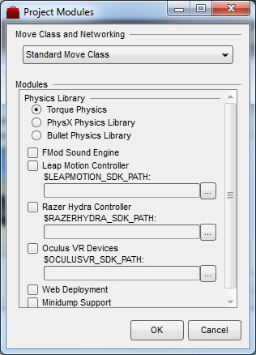

Before you can use the Oculus Rift with Torque 3D you will need to download the OculusVR SDK and then recompile your game to include the required source code.

### Get the OculusVR SDK ###

You can download the OculusVR SDK from their [web site](http://developer.oculusvr.com) and extract it to a convenient directory.  To date, version 0.1.5 of the OculusVR SDK has been tested with Torque 3D.

### Manually Configuring Your project.conf ###

There are two ways to set up your project to load in the required source code.  The first is by manually editing your project's `project.conf` file as outlined here.  The second way is to use the new [Project Manager 2.0](https://github.com/GarageGames/Torque3D/wiki/Project-Manager) to set everything up using its GUI.  Please see the next section if you're interested in using the *Project Manager*.

With the OculusVR SDK in place, you will need to modify your project's `buildFiles/config/project.conf` file in a text editor.  This will allows us to recompile our game with the required source code.  The first step is to let Torque 3D's Project Generator know where the OculusVR SDK is located.  The easiest way to do this is to add the `$OCULUSVR_SDK_PATH` global variable to the top of your `project.conf` file.  For example:

`$OCULUSVR_SDK_PATH = "C:\Users\dwyand_2\Downloads\OculusRift\ovr_sdk_0.1.5_src\OculusSDK";`

You may also create a Windows environmental variable named `TORQUE_OCULUSVR_PATH` that also provides an absolute path to the OculusVR SDK.  Going this route doesn't store the path within the `project.conf` file, which may be required if multiple developers are working on the same project.

The second addition to your `project.conf` file is a reference to the Torque 3D's Project Generator module for the Oculus Rift.  Add the following between the `Torque3D::beginConfig()` and `Torque3D::endConfig()` lines:

```
    // Include Oculus Rift module
    includeModule( 'oculusVR' );
```

The last step is optional but if you want to use Torque 3D's standard *Player* and *Camera* classes with the Rift then you should probably make this change.  In order to pass the Rift's head tracking information between the client and server (which exist internally even if running a single player game) you need to enable the *ExtendedMove* class.  This is done by setting the `$TORQUE_EXTENDED_MOVE` global variable to true:

```
// Set this to true to enable the ExtendedMove class.  This
// allows the passing of absolute position and rotation input
// device information from the client to the server.
$TORQUE_EXTENDED_MOVE = true;
```

With these changes in place you may run your project's `generateProjects.bat` file to rebuild the various Visual Studio files, and then recompile your game.

#### Example project.conf ####

Here is a complete example of a `project.conf` file with all of the required changes:

```
<?php

// Set this true to enable hifi networking instead of standard.
// In general ... hifi is designed to better deal with fast
// moving players in close proximity to each other, such as
// a racing game.
$TORQUE_HIFI_NET = false;

// Set this to true to enable the ExtendedMove class.  This
// allows the passing of absolute position and rotation input
// device information from the client to the server.
$TORQUE_EXTENDED_MOVE = true;

// Our path to the Oculus VR SDK:
$OCULUSVR_SDK_PATH = "C:\Users\dwyand_2\Downloads\OculusRift\ovr_sdk_0.1.5_src\OculusSDK";

// Configure Torque 3D
Torque3D::beginConfig( "win32", "RiftValley" );

    // Include Oculus Rift module
    includeModule( 'oculusVR' );
    
    // Enable for optional minidump debugging support
    // addProjectDefine( 'TORQUE_MINIDUMP' );
        
Torque3D::endConfig();

?>
```

### Using the Project Manager to Configure Your Project###

The previous section outlined how to manually modify your project's `project.conf` file to include the required source code for using the Oculus Rift.  In this section we will step you through using the new [Project Manager 2.0](https://github.com/GarageGames/Torque3D/wiki/Project-Manager) to accomplish the same task.

Start by launching the *Project Manager* (at least version 2.0) and selecting your project from the list.  Then click on the *Modules* button to open the *Project Modules* window.



To add Oculus Rift support click on the *Oculus VR Devices* checkbox.  You also need to tell the system where your OculusVR SDK is located.  Either click on the button beside the `$OCULUSVR_SDK_PATH` text field, or manually enter in the path to your SDK's location.  It should look something like this:

`C:\Users\dwyand_2\Downloads\OculusRift\ovr_sdk_0.1.5_src\OculusSDK`

The last step is optional but if you want to use Torque 3D's standard *Player* and *Camera* classes with the Rift then you should probably make this change.  In order to pass the Rift's head tracking information between the client and server (which exist internally even if running a single player game) you need to enable the *ExtendedMove* class.  This is done by clicking on the *Move Class and Networking* dropdown and selecting the *ExtendedMove* choice.

With all of these steps complete you click on the *Project Modules* window's *Regenerate* button to rebuild your Visual Studio solution files.  Be sure to not have your project loaded in Visual Studio when you click on this button.  When the regenerate step is complete you can load your project back into Visual Studio and recompile it.
