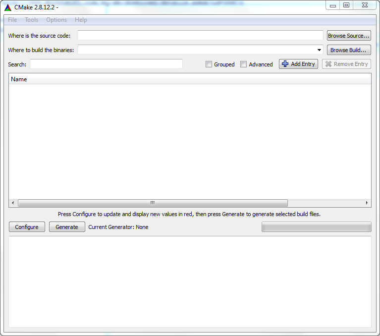
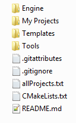
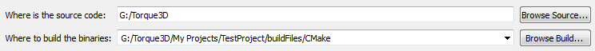
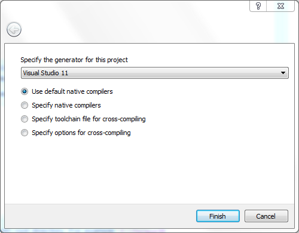
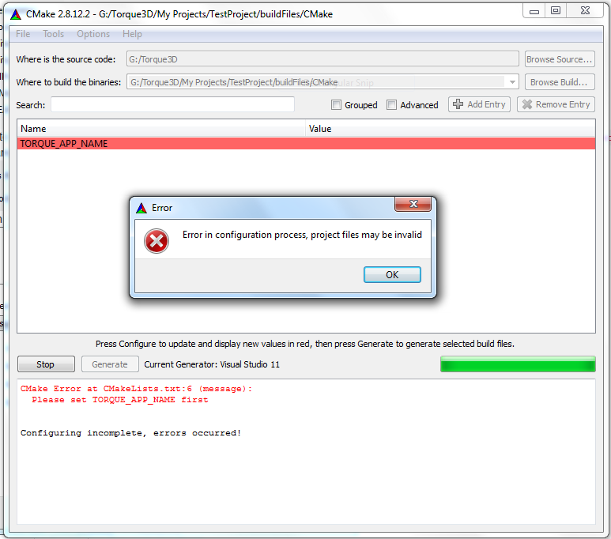
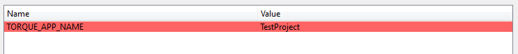
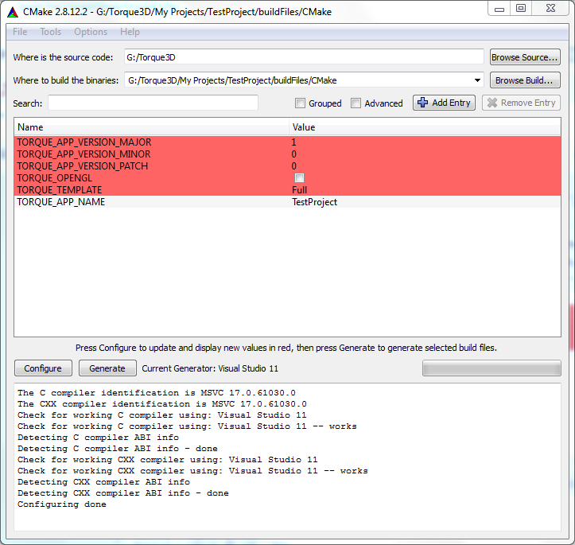
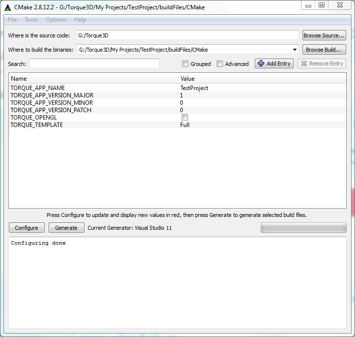
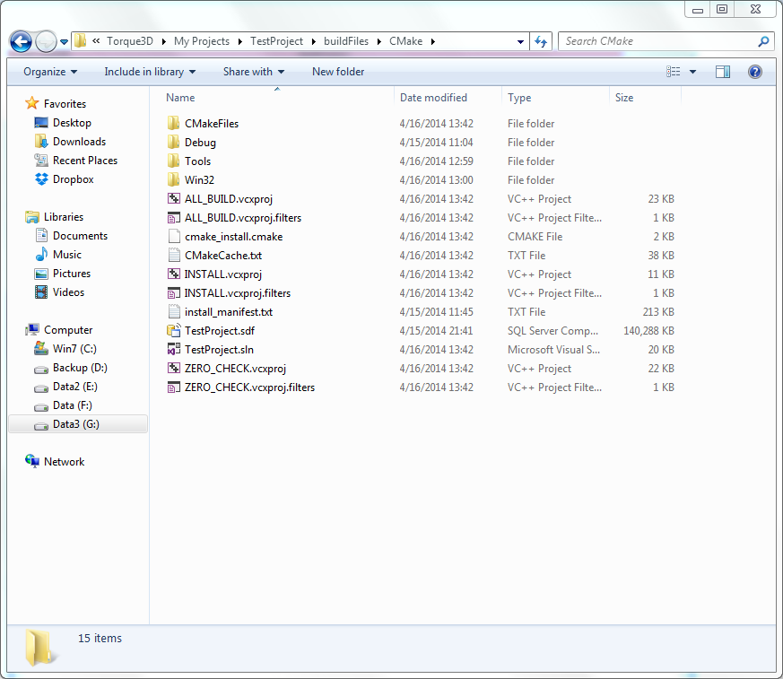

CMake project generator
-----------------------------

* Start CMake(cmake-gui)

* `ProjectName` will be used later, and you have to choose one to use the same in the following steps. For example: `TestProject`
* Set `Where is the source code`: Full path to Torque3D root directory. For example `G:\Torque3D`

* Set `Where to build de binaries`: Full path to Torque3D to build CMake cache and MSVC solution files. `Torque root path` + `/My Projects/` + `ProjectName` + `/buildFiles/CMake`
For example: `G:/Torque3D/My Projects/TestProject/buildFiles/CMake`

* Click on `Configure` button

* Select generator for solution files and click finish.
* We will see this error message. Is normal, we have to set the name of the project.

* Set 'TORQUE_APP_NAME' to your `ProjectName`. For example: `TestProject`

* Click on `Configure` button. Red are new configuration variables.

* Change `TORQUE_TEMPLATE` if you want to use Empty or other template
* On Linux you need to select `TORQUE_BUILD_TYPE`(Debug, Release or RelWithDebugInfo) 
* Click on `Configure` button.

* Click on `Generate` button.
* Go to `Where to build de binaries` dir for find generated files. For example: `G:\Torque3D\My Projects\TestProject\buildFiles\CMake`

* Build Torque3D with generated files.
* Build `INSTALL` project/target first and ONLY ONE. `INSTALL` project build all projects and then copy template files on your game directory.
* For future builds use `ALL_BUILD`.
* That's all :D
